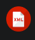

# Documentación UD1 Lenguajes de Marcas

## Introducción a Lenguajes de marcas

### Definición

Un lenguaje de marcas organiza información mediante una sintaxis basada en marcas o etiquetas.

### Clasificación de Lenguajes de marcas

|Tipo|Uso|Ejemplos|
|----|---|--------|
|Presentación|Dar formato a documentos de texto|HTML,CSS|
|Intercambio de información|Almacenar información de forma ordenada|XML, RSS|
|Documentación|Documentar proyectos|Markdown, WikiTex|

## Instalación y configuración del entorno

1. Instalamos [VS Code](https://code.visualstudio.com/)
2. Instalamos plugins
   - [HTML CSS Support](https://marketplace.visualstudio.com/items?itemName=ecmel.vscode-html-css)
   - [Live Preview](https://marketplace.visualstudio.com/items?itemName=ms-vscode.live-server)
   - [Markdown All in One](https://marketplace.visualstudio.com/items?itemName=yzhang.markdown-all-in-one)
   - [XML (Red Hat)](https://marketplace.visualstudio.com/items?itemName=redhat.vscode-xml)
3. Instalamos git
```bash
sudo apt install
```
4. Configurar repositorio git (en la carpeta principal del proyecto)
```bash
git init
git add .
git commit -m "Inicializar repositorio y README básico UD1"
```

## Descripción de plugins
|Nombre|Imagen|Uso|
|-|-|-|
|HTML CSS Support||Facilitar sintaxis y autocompletado de CSS|
|Live Preview||Visualizar los HTML formateados|
|Markdown All in One||Visualizar los Markdown formateados|
|XML||Facilitar sintaxis y autocompletado de XML|